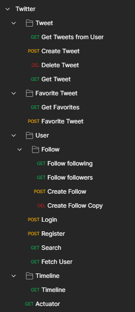

<br />
<p align="center">
  <a href="https://github.com/jjeanjacques10/twitter-microservices">
    
  </a>

<h3 align="center">Microservices Architecture of Twitter Service</h3>
  <p align="center">
    Repository to recreate the microservices architecture of Twitter. 
    <br />
    <a href="https://github.com/jjeanjacques10/twitter-microservices"><strong>Explore the docs »</strong></a>
    <br />
    <br />
    <a href="https://github.com/jjeanjacques10/twitter-microservices/issues">Report Bug</a>
    ·
    <a href="https://github.com/jjeanjacques10/twitter-microservices/issues">Request Feature</a>
  </p>
</p>

### Tweet Service

The first service created was Tweet Service. Microservice to record tweets and favorite actions.

### User Service

Manage users profiles to control authentication and authorization actions.

### Eureka Service

Service Discovery, it's where I'll register my microservices.

### Gateway Service

Gateway provides a flexible way of routing requests.

## Technologies

- [Spring Boot](https://spring.io/projects/spring-boot)
- [Spring Cloud](https://spring.io/projects/spring-cloud)
- Java 17
- Docker
- MySQL
- DynamoDB

## Get Started

Running Databases:

```
docker-compose up -d --build
```

Access DynamoDb Admin: http://localhost:8001/

### Postman

Access postman collection **[here](./files/Twitter.postman_collection.json)**



## Tables

- tweet (MySQL)
- tb_favorite_tweets (Dynamo)
    - Table Schema: [environment/dynamodb/tables.json](./environment/dynamodb/tables.json)

## Functional Requirements

The reference to functional requirements is this
article: [Design Twitter — Microservices Architecture of Twitter Service](https://thinksoftware.medium.com/design-twitter-microservices-architecture-of-twitter-service-996ddd68e1ca)

1. The users can post new messages or tweets (this is a write operation).

2. The size of a tweet is 140 characters at most.

3. A user can delete his tweets but not update/edit his posted tweets (this is a write operation).

4. The users can mark favorite tweets (write operation).

## Diagrams

<p align="center">

</p>

## Contact

[Linkedin](https://www.linkedin.com/in/jjean-jacques10) | [Github](https://github.com/jjeanjacques10/)
| [Medium](https://jjeanjacques10.medium.com/) | [Email](jjean.jacques10@gmail.com)

Project
Link: [https://github.com/jjeanjacques10/twitter-microservices](https://github.com/jjeanjacques10/twitter-microservices)

---
Developed by [Jean Jacques Barros](https://github.com/jjeanjacques10)